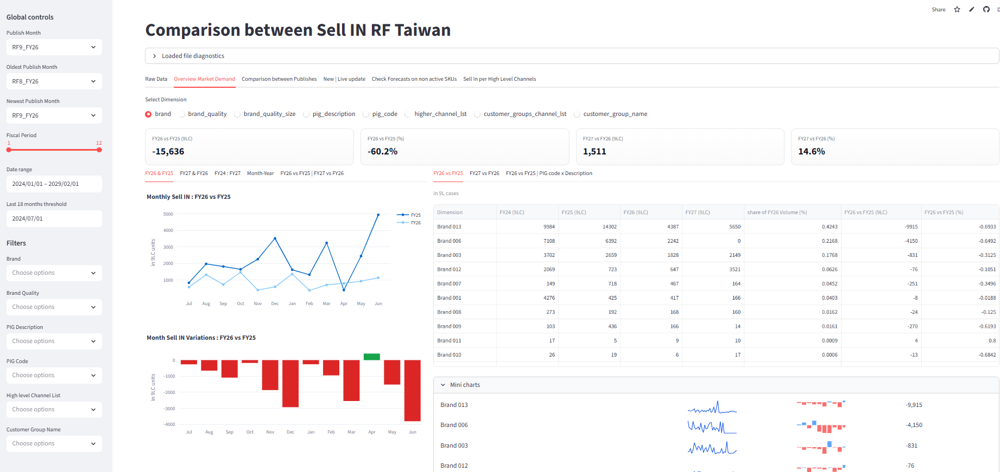

# WS-Forecast-Tracker

A Python-based forecasting and publish-comparison app built with Streamlit.

This project was originally developed as an R Shiny application. It has now been migrated to Python within the working environment.  
The Python version provides a more maintainable, portable, and scalable solution for interactive forecast tracking and publish comparison.

---

## App Preview



**Note:**  
The screenshot and sample data included in this repository are for demonstration purposes only.  
They do **not** represent real business data.

---

## Live Application

The app is available here:

[Open Streamlit App]([https://ws-forecast-tracker-w96mrjqr47k2zy5htvgrmk.streamlit.app/](https://ws-forecast-tracker-demo-5vi6gveurv2hzdmhw6t4hs.streamlit.app/))

---

## Project Overview

WS-Forecast-Tracker is an interactive dashboard designed to compare different publish versions of forecast data and help users quickly identify changes, gaps, and trends across dimensions such as customer, product, and period.

The app supports business users in reviewing forecast updates more efficiently without relying on manual Excel comparisons.

Typical use cases include:
- Comparing old vs. new publish versions
- Tracking forecast changes across periods
- Reviewing monthly differences at aggregated and detailed levels
- Supporting business discussion before final forecast alignment
- Providing a lighter and more sustainable replacement for the former R Shiny solution

---

## Why This Project Was Migrated from R Shiny to Python

This project was originally created in **R Shiny**, but it was migrated to **Python + Streamlit** because the group environment no longer supports R Shiny as an approved software solution.

The migration brings several benefits:
- Better alignment with current technical governance
- Easier deployment and maintenance
- Stronger compatibility with Python-based data workflows
- Better extensibility for future analytics features
- Simpler handover and long-term support

---

## Key Features

### 1. Publish-to-Publish Comparison
Compare two forecast publishes side by side and identify changes between versions.

### 2. Difference Detection
Highlight volume changes between old and new publishes to help users focus on what moved.

### 3. Flexible Filtering
Filter the data by key business dimensions such as:
- Customer group
- Pig code / product
- Brand
- Period
- Channel-related attributes

### 4. Monthly Change Review
Review differences at monthly level to understand where adjustments happened over time.

### 5. Interactive Exploration
Users can dynamically adjust filters and immediately see updated results in the dashboard.

### 6. Lighter Replacement for Manual Comparison
Reduce repeated Excel-based comparison work and provide a more standardized review experience.

---

## Repository Structure

```text
WS-Forecast-Tracker/
├─ Data Source/          # Sample or supporting source files
├─ screenshot.png        # App preview image
├─ streamlit_app.py      # Main Streamlit application
├─ requirements.txt      # Python dependencies
└─ README.md             # Project documentation
